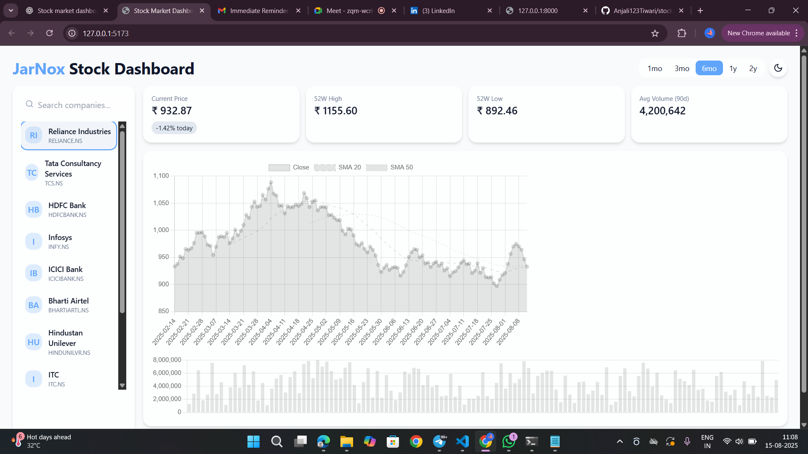

# Stock Market Dashboard Pro

**Stock Market Dashboard Pro** is a Python-powered web application that allows users to visualize and analyze stock market data in real-time or using offline datasets. The project combines an efficient backend API with a clean, responsive frontend interface to make financial data analysis accessible.

### Development Approach
The project began with identifying the need for both **real-time data** and an **offline testing mode**. I first set up the backend using **FastAPI** to fetch and process stock data from the Yahoo Finance API. This included endpoints for current prices, historical trends, and key performance metrics.  
Next, I prepared sample CSV datasets for three major Indian companies—Reliance Industries, TCS, and HDFC Bank—so the dashboard could be tested without internet access. For the frontend, I designed an interactive dashboard (planned with React/Next.js) that uses **Plotly** charts for clear visualizations. Finally, I integrated both components, ensuring smooth communication via REST API calls.

### Technologies Used
- **Backend:** FastAPI, Python, Pandas, yfinance  
- **Frontend:** React/Next.js, Plotly.js (for data visualization)  
- **Data:** Yahoo Finance API + CSV datasets  
- **Version Control:** Git & GitHub  

### Challenges Encountered
The biggest challenge was ensuring API reliability and handling market data inconsistencies. I also faced issues with **CORS errors** when connecting the frontend to the backend, which required configuration fixes in FastAPI. Additionally, formatting the CSV datasets to match API responses was crucial for seamless switching between online and offline modes.

